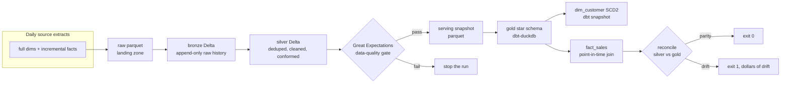

# retail-lakehouse

A batch medallion lakehouse that turns messy daily retail extracts into a governed star schema, with data quality enforced at every layer and a reconciliation step that proves the gold layer still equals the silver layer it was built from.


> The 10-second version: `rlh run` ingests two days of retail data through bronze and silver Delta tables, builds a dbt star schema with a full SCD2 customer dimension, validates every layer with Great Expectations, and reconciles the result to the dollar: **$3,198,044.17 of fact revenue equals $3,198,044.17 of silver revenue, 4,706 fact rows equal 4,706 silver order lines, 420 current dimension rows equal 420 silver customers.** Break the data and the run exits non-zero.

## Why this exists

A lakehouse is only trustworthy if the curated output provably matches its input. The failure that costs money is not a crash, it is quiet drift: a sale attributed to the wrong customer segment because the SCD2 join grabbed the current version instead of the version valid at purchase time, or a dashboard that is subtly wrong because silver dropped rows the gold layer still counts. Those bugs pass row-count checks and surface downstream, after decisions have been made on them.

This project treats correctness as the deliverable. It builds the full medallion (bronze to silver to gold), enforces data contracts at each boundary, resolves the customer dimension point-in-time so historical attribution is right, and then reconciles gold against silver and expresses any disagreement in dollars so it can gate a release.

## Architecture



Bronze and silver are real Delta tables written with delta-rs (no JVM). Gold is a dbt-duckdb star schema: `dim_customer` (SCD2 via a dbt snapshot), `dim_product`, `dim_date`, and `fact_sales` at order-line grain. The Spark jobs, Airflow DAG, and Terraform are the production equivalents, shipped as reviewed code.

## What runs locally vs what ships as production code

| Concern | Local (runnable, tested) | Production (shipped, structure-tested) |
|---|---|---|
| Bronze/silver compute | delta-rs (`deltalake`) | `spark/` PySpark jobs |
| Gold transforms | dbt-duckdb | same dbt project, any warehouse adapter |
| Data quality | Great Expectations 1.x | same suites (JSON in `great_expectations/`) |
| Orchestration | the `rlh` CLI | `dags/` Airflow DAG + `docker-compose.yml` |
| Infra | n/a | `deploy/terraform/` (S3 + Glue + IAM) |

Everything in the left column runs in CI in seconds. The right column is not run in CI (no cluster), so no Spark or cluster throughput is claimed anywhere.

## Tech stack and why

| Choice | Role | Why |
|---|---|---|
| Delta Lake (delta-rs) | Bronze/silver tables | ACID snapshots, time travel, and versions without a JVM, so the lakehouse is real and runnable locally |
| dbt (dbt-duckdb) | Gold star schema + SCD2 | Declarative models, built-in snapshots for SCD2, and tests as the gold-layer quality gate |
| Great Expectations | Silver data contracts | Explicit, serializable expectation suites that fail the batch on violation |
| DuckDB | Silver transforms + warehouse | Fast, in-process SQL that reads parquet natively, no server |
| Apache Spark (PySpark) | Production bronze/silver | The cluster-scale engine the local delta-rs path stands in for |
| Apache Airflow | Orchestration | Schedules the daily batch and stops it on a failed gate |
| Terraform | Infrastructure | Encrypted S3 lake, Glue catalog per layer, least-privilege IAM |

## Quickstart

```bash
pip install -e ".[dev]"

# build two days end to end and reconcile (exit 0 on parity)
rlh run --root /tmp/lake --days 2 --customers 400 --orders-per-day 1200

# inspect the layers
rlh inspect --root /tmp/lake

# run just the Great Expectations gate on silver
rlh validate --root /tmp/lake

# reconcile gold against silver on its own
rlh reconcile --root /tmp/lake
```

A representative `inspect` after a two-day run:

```
customers    bronze v1 rows=840   silver rows=420
products     bronze v1 rows=80    silver rows=40
orders       bronze v1 rows=2,400 silver rows=2,341
order_items  bronze v1 rows=4,854 silver rows=4,706
gold.dim_customer rows=468   (420 current + 48 changed customers versioned)
gold.fact_sales   rows=4,706
```

## How SCD2 works here

The customer dimension keeps every version of a customer with a validity window. A dbt snapshot (timestamp strategy on the source `updated_at`) opens a new version only when a tracked attribute actually changes, so an unchanged customer keeps a single row and a customer who moves from SMB to ENT gets two versions with adjacent `valid_from`/`valid_to` dates.

The sales fact then resolves each order line to the version that was valid at the order timestamp:

```sql
left join dim_customer c
  on  c.customer_id = orders.customer_id
  and orders.order_ts >= c.valid_from
  and orders.order_ts <  coalesce(c.valid_to, timestamp '9999-12-31')
```

So a purchase made while the customer was SMB stays attributed to SMB forever, even after they become ENT. Reconciliation asserts exactly one current version per customer and zero unresolved keys.

## The hardest problem

The point-in-time join above has a classic trap. The current version of every customer has a null `valid_to`. The first implementation wrote `order_ts < c.valid_to` without the coalesce, so for every current customer the predicate compared against null, returned unknown, and matched nothing. Result: every order belonging to a current customer got a null surrogate key, the `not_null` and `relationships` tests on `fact_sales.customer_sk` failed, and a large slice of revenue silently fell out of the fact. Wrapping the upper bound in `coalesce(valid_to, timestamp '9999-12-31')` fixes it.

A second, subtler bug lived in the data itself: the generator initially stamped every daily extract with the current day as `updated_at`, so the timestamp-strategy snapshot saw a "change" for every customer every day and opened a spurious version for all of them. The fix was to advance `updated_at` only on a real attribute change, which is also the honest modeling rule (see ADR-002).

## Performance

Single process, local delta-rs + dbt-duckdb, at 2,000 customers and 8,000 orders/day over 2 days. Regenerate with `python benchmark/run.py --write`.

| Stage | Throughput |
|---|---|
| bronze append (delta-rs) | ~281,000 rows/s |
| silver refine (duckdb + delta-rs) | ~214,000 rows/s |
| gold build (dbt-duckdb, wall time) | ~5.3 s |
| reconcile | ~393,000 rows/s |

Gold is a fixed dbt overhead (model compilation and duckdb writes), not a per-row rate. Spark-cluster throughput is deliberately not claimed.

## Security and compliance

- Terraform provisions an S3 lake with KMS encryption at rest, versioning, and a full public-access block, plus a least-privilege IAM role scoped to the lake bucket, its KMS key, and Glue catalog operations.
- No secrets in the repo; the pipeline reads storage and warehouse locations from environment variables.
- Bronze is append-only, giving an immutable audit trail of every extract received.
- PII masking and row-level access are deployment-specific and out of scope here (see below).

## Failure modes

| Symptom | Exit code | Cause and response |
|---|---|---|
| `rlh run` reports parity | 0 | Gold faithfully represents silver |
| Great Expectations suite fails | 1 | A silver contract broke (bad segment, null key, non-positive quantity); the run stops before building gold |
| Reconciliation reports drift | 1 | Gold disagrees with silver (revenue drift in dollars, row-count mismatch, unresolved keys, or multiple current versions) |
| Bad or missing arguments | 2 | Invalid configuration |
| Missing input or engine error | 3 | A layer path or the warehouse could not be read |

## What was deliberately left out

- A live Spark or Airflow run in CI. Both ship as production code validated by structure tests; there is no cluster in CI.
- Incremental dbt models and merge-on-read compaction. Gold is rebuilt each run; a high-churn table would use incremental models plus a maintenance job.
- Multi-fact and conformed-dimension expansion beyond the single sales fact.
- Schema evolution across extracts, PII masking, and row-level security, which are deployment-specific.
- Streaming ingestion. This is the batch companion to a CDC streaming pipeline; real-time change capture is a separate project.

## Design decisions

- [ADR-001: Medallion architecture with Delta bronze/silver and a dbt gold star schema](docs/ADR-001-medallion-architecture.md)
- [ADR-002: SCD2 via dbt snapshot and point-in-time fact resolution](docs/ADR-002-scd2-and-point-in-time.md)

## License

Apache-2.0.
